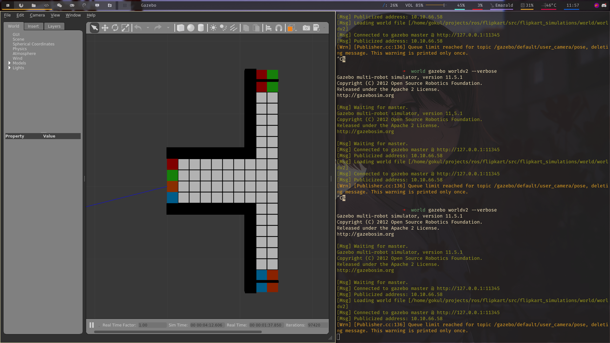

# flipkart grid challenge

## Custom Map 
 

## Intel realsense gazebo plugin 
```
git clone https://github.com/intel/gazebo-realsense.git
cd gazebo-realsense
mkdir build
cd build
cmake -DCMAKE_CXX_STANDARD=17 .. # use cpp-17 for clearing ignition error 
make
sudo make install
```
# TODO 
- Clear err spawn service 
- clear err process has died 
- Topic not published in rviz (find the reason)
