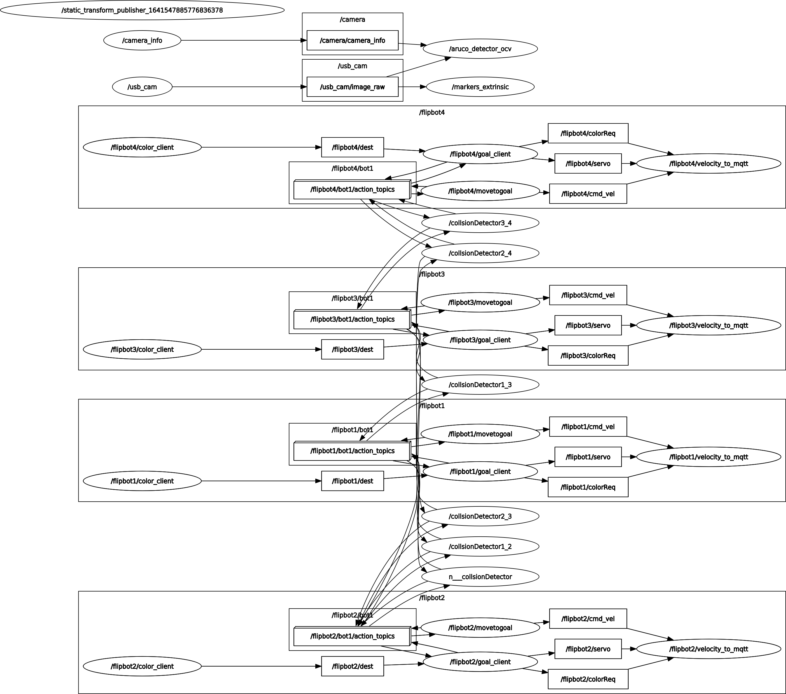

# Flipkart grid challenge
Autonomous swarm robots 🤖 using centralised server and cameras for pose estimation and navigation.These robots can navigate in the given map co-oppertively without any human internvention.

## In action 🎬
https://user-images.githubusercontent.com/59414965/166818389-20eabf92-4f86-454a-8baa-6d14b44bb1da.mp4


## image proccesing video 🔥
https://user-images.githubusercontent.com/59414965/166814504-c7978c31-b833-4a35-ac8d-28a76f8d684c.mp4


## Custom Map 🗺️
 


## Intel realsense gazebo plugin 📷
```bash
git submodule add git submodule add https://github.com/issaiass/realsense2_description
git submodule add https://github.com/issaiass/realsense_gazebo_plugin
```
- steps to convert xacro to urdf
```
rosrun xacro xacro test_d435_camera.urdf.xacro > d435.urdf  # convert xacro to urdf
gz sdf -p d435.urdf > d435.sdf         # urdf to sdf
```
- detailed explaination [here](https://nu-msr.github.io/me495_site/lecture10_sdf_gazebo.html) 

## Group launch of robots
[multiple controller error](https://robotics.stackexchange.com/questions/21673/tried-to-advertise-a-service-that-is-already-advertised-in-this-node-leo-contr) 
[multi robot launch](https://answers.ros.org/question/41433/multiple-robots-simulation-and-navigation/)

## hardware interface 
[arduino hardware interface](https://github.com/joshnewans/diffdrive_arduino) 
## camera calibiration ros
- [camera calibiration](http://wiki.ros.org/camera_calibration/Tutorials/MonocularCalibration) 

## Links
- [xacro conditional](https://get-help.robotigniteacademy.com/t/conditional-block-for-params-on-macro-xacro/3095) 
## Round 2 overview
 
## TODO
-  odom publisher not working
